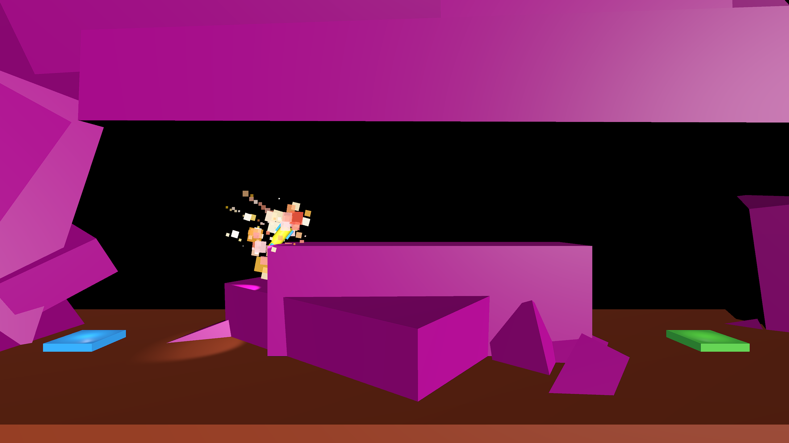
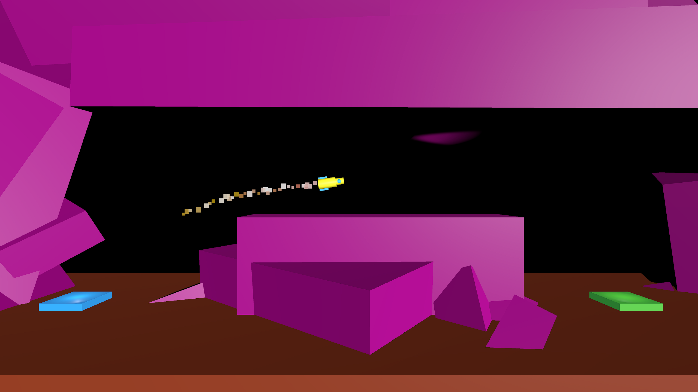
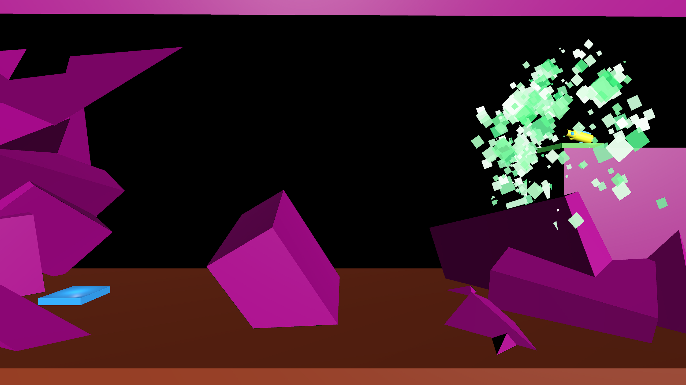
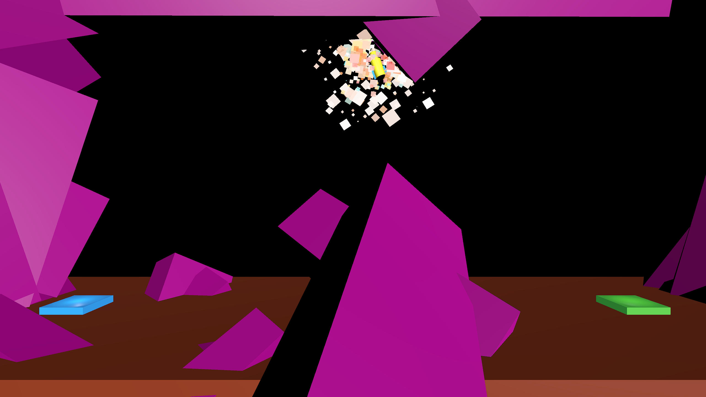

# ROCKET ROLL

Pilot a malfunctioning rocket to escape a collapsing mining world.

## Current State

- User can control the rocket and collide with obstacles.
- Win and lose conditions with explosion and success effects and sounds.
- Three levels prototyped with Unity primitive shapes.

## TODO

- import assets to replace prototype shapes
- create additional levels
- Start menu with controls
- UI with intro story text
- add rock n' roll style music and update sound effects
- update particle effects

## Tech

|                                                 |                     |
| ----------------------------------------------- | ------------------- |
|       | Scripting with C#   |
|    | Unity Game Engine   |
|  | Blender 3D Modeling |
|                                                 |                     |

## Screen Shots

